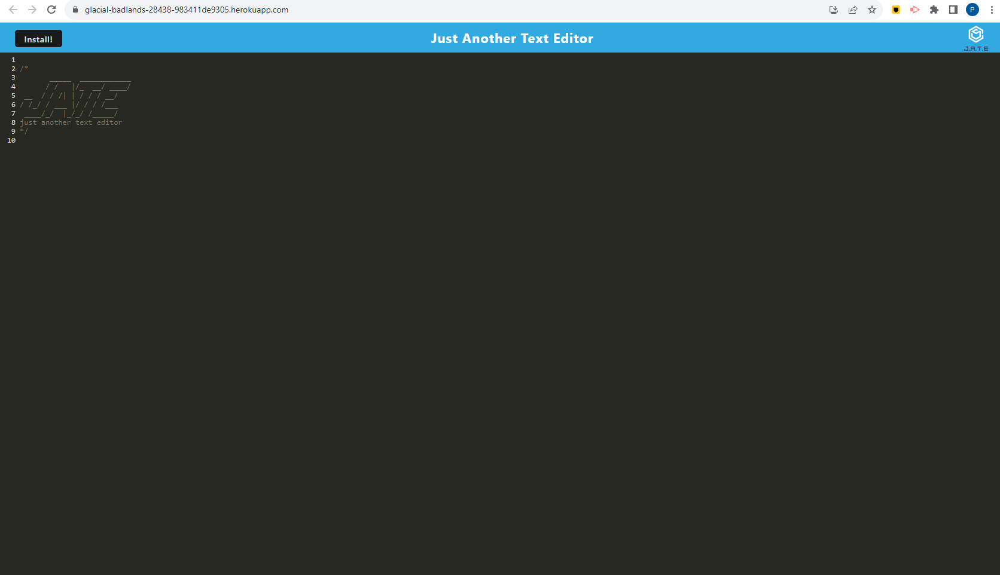

# 

# PWA-Text-Editor

## [Patrick Lowe](https://github.com/PatrickWLowe)

## Description

#### An application that you can install that allows you to take notes that save.

## Technologies-Used


### GitBash

### Nodemon

## Installation

#### You will need clone the repository and open the folder locally. Then you will need to run npm install in the parent folder. Then npm start to get the application working as a test before launching on heroku.

## Acceptance Criteria

```md
GIVEN a text editor web application
WHEN I open my application in my editor
THEN I should see a client server folder structure
WHEN I run `npm run start` from the root directory
THEN I find that my application should start up the backend and serve the client
WHEN I run the text editor application from my terminal
THEN I find that my JavaScript files have been bundled using webpack
WHEN I run my webpack plugins
THEN I find that I have a generated HTML file, service worker, and a manifest file
WHEN I use next-gen JavaScript in my application
THEN I find that the text editor still functions in the browser without errors
WHEN I open the text editor
THEN I find that IndexedDB has immediately created a database storage
WHEN I enter content and subsequently click off of the DOM window
THEN I find that the content in the text editor has been saved with IndexedDB
WHEN I reopen the text editor after closing it
THEN I find that the content in the text editor has been retrieved from our IndexedDB
WHEN I click on the Install button
THEN I download my web application as an icon on my desktop
WHEN I load my web application
THEN I should have a registered service worker using workbox
WHEN I register a service worker
THEN I should have my static assets pre cached upon loading along with subsequent pages and static assets
WHEN I deploy to Heroku
THEN I should have proper build scripts for a webpack application
```

## License

## This project is licensed under the MIT License

[MIT](https://opensource.org/licenses/MIT)

## Screenshots of the APP




## Deployed application URL

### https://glacial-badlands-28438-983411de9305.herokuapp.com/

## References

## https://stackoverflow.com/questions/69498498/how-to-save-data-with-pwa

## https://stackoverflow.com/questions/58985103/progressive-web-app-not-showing-install-button-in-browser-bar
